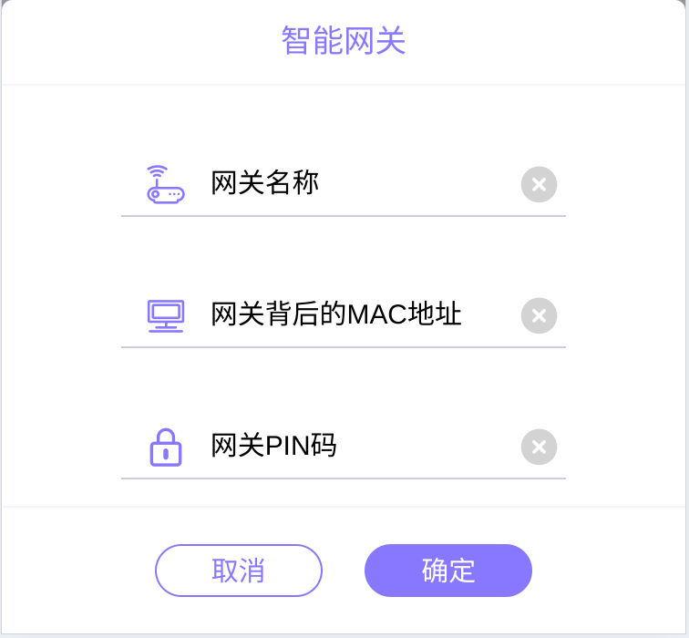

## hass-lierda-iot

利尔达网关 Home Assistant 插件

苦于lierda设备系统无法接入HA，便自己写了HA插件`Lierda iot`。
主要通过lierdalux接口控制lierda设备，目前支持的设备有：

- [x] 门磁
- [x] 开关
- [x] 窗帘(部分)
- [x] 灯光(未测试)
- [ ] 红外
- [ ] 更多设备适配中...

精力有限，设备有限，欢迎大家一起完善。

## 使用说明

1. 在[lierda-lux 后台](https://www.lierdalux.cn)注册账号
2. 添加智能网关
   
3. 添加成功后，会自动添加网关下所有设备
4. 在HA中添加`custom_components`目录，将`lierda_iot`目录拷贝到`custom_components`目录下
5. 设置手机号、登录密码、刷新间隔即可自动添加所有受支持的设备

## TODO

- [ ] 设备图标、美观
- [ ] 设备属性抽离
- [ ] reload实现
- [ ] option_flow实现
- [ ] HA测试用例
- [ ] 更多设备适配
- [ ] lierda-lux经常假死不可用，寻找另外的途径控制设备。
- [ ] 研究本地网关mqtt

## 版本更新说明

### v1.0.0

- [x] 实现基本功能
- [x] 账号配置
- [x] 刷新间隔配置
- [x] 定时刷新状态
- [x] 接入门磁；具体实现在 `sensor.py` 和 `binary_sensor.py`
- [x] 接入开关；具体实现在 `switch.py`
- [x] 接入窗帘；具体实现在 `cover.py`
- [x] 接入部分灯光；具体实现在 `light.py`

## lierda相关文档资源

- [lierda-lux 后台](https://www.lierdalux.cn)
- [智能网关:桌面型智能网关说明书](http://n2n.lierdalux.cn:8083/lib/exe/fetch.php?media=%E6%99%BA%E8%83%BD%E7%BD%91%E5%85%B3:%E6%A1%8C%E9%9D%A2%E5%9E%8B%E6%99%BA%E8%83%BD%E7%BD%91%E5%85%B3%E8%AF%B4%E6%98%8E%E4%B9%A6.pdf)
- [Lierdalux产品发布系统](http://n2n.lierdalux.cn:8083/doku.php)
