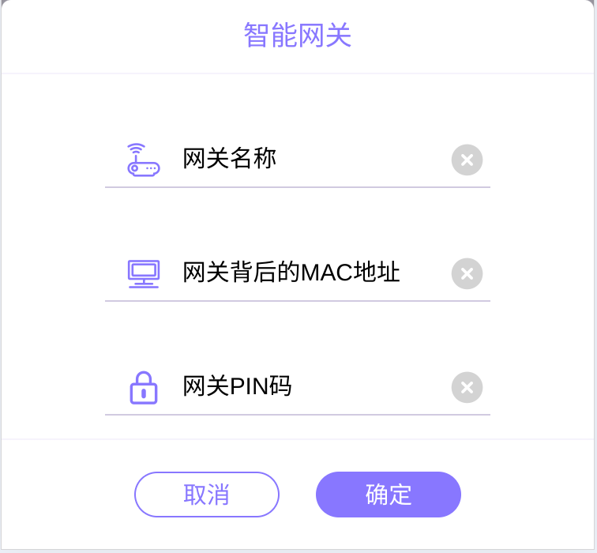

## hass-lierda-iot

利尔达网关 Home Assistant 插件

苦于lierda设备系统无法接入HA，便自己写了HA插件`Lierda iot`。
主要通过lierdalux接口控制lierda设备，目前支持的设备有：

- [x] 门磁
- [x] 开关
- [x] 窗帘(部分)
- [x] 灯光(未测试)
- [ ] 红外
- [ ] 更多设备适配中...

精力有限，设备有限，欢迎大家一起完善。

## 安装方法

### 方法一：通过 HACS 安装（推荐）

1. 确保你的 Home Assistant 已经安装了 [HACS](https://hacs.xyz/)
2. 在 HACS 中添加自定义仓库：
   - 打开 HACS → 集成
   - 点击右上角三个点 → 自定义仓库
   - 仓库 URL：`https://github.com/qcgzxw/hass-lierda-iot`
   - 类别：集成
   - 点击添加
3. 在 HACS 中搜索并安装 "Lierda IoT"
4. 重启 Home Assistant
5. 在设置 → 设备与服务 → 添加集成中搜索 "Lierda IoT"

### 方法二：手动安装

1. 前往 [Releases](https://github.com/qcgzxw/hass-lierda-iot/releases) 页面
2. 下载最新版本的 `lierda_iot.zip` 文件
3. 解压后将 `lierda_iot` 文件夹上传到 Home Assistant 的 `custom_components` 目录
4. 重启 Home Assistant
5. 在设置 → 设备与服务 → 添加集成中搜索 "Lierda IoT"

## 使用说明

### 支持平台

- [x] [lierda-lux 后台](https://www.lierdalux.cn)
- [x] [lierda智能教室 后台](https://lsd.lierdalux.cn)
- [x] [lierda智能酒店 后台](https://hotel.lierdalux.cn)

PS: 以上平台均可注册智能家居网关，功能基本完全一样但是相互隔离；不同平台下注册的同一网关不可无缝切换，需要重新配置。

1. 在以上平台注册账号，平台可以三选一
2. 添加智能网关
   
3. 添加成功后，会自动添加网关下所有设备
4. 在HA中添加`custom_components`目录，将`lierda_iot`目录拷贝到`custom_components`目录下
5. 设置手机号、登录密码、刷新间隔即可自动添加所有受支持的设备

## TODO

- [ ] 设备图标、美观
- [ ] 设备属性抽离
- [ ] reload实现
- [ ] option_flow实现
- [ ] 更多设备适配

## 版本更新说明

### v2.0.2

- [x] **修复灯具兼容性**：为 `light` 实体补充设定 `_attr_color_mode` 属性，修复了在 Home Assistant Core 2025.3 及更新版本中，因实体不汇报颜色模式 (color_mode) 而产生的警告并在将来停止工作的异常。

### v2.1.0

- 修复配置流中重复账号时 `AbortFlow` 被吞掉的问题，恢复标准 `already_configured` 行为
- 设备控制失败现在会向 Home Assistant 正确报错，不再静默成功
- 配置流和选项流统一刷新间隔校验，并修复异常路径下 client/session 释放
- 测试覆盖新增重复配置、非法轮询间隔、异常传播等关键回归场景
- 升级 Home Assistant 依赖到 2025.10.2+ 并刷新锁文件，收敛已知依赖风险

### v2.0.1

- [x] **升级 Home Assistant 支持**：依赖升级至 `homeassistant ^2025.1.0`（实际安装 2025.4.4），全面支持 HA 2025.x。
- [x] **Python 3.13 支持**：开发环境升级至 Python 3.13，`.venv` 使用系统 Python 3.13.12。
- [x] **CVE 安全修复**：通过升级 `aiohttp`（随 HA 2025.x 升级至 3.11.16）修复多项安全漏洞（CVE-2024-27306、CVE-2024-23334、CVE-2024-52304、CVE-2025-69223、CVE-2025-69226、CVE-2025-69228）。
- [x] **测试套件全通过**：修复所有 29 个失败测试用例，实现 100/100 测试通过。
  - `Device` 数据类字段增加可选默认值（`firmware_version`、`link`）
  - `LierdaDataUpdateCoordinator` 构造函数中 `config_entry` 改为可选参数
  - 更新测试 mock 以兼容 HA 2025.x `ConfigEntryState` API
- [x] **智能酒店支持**：支持智能酒店后台。

### v2.0.0 (重构版)

- [x] **底层架构全面重构**：引入 Home Assistant 官方推荐的 `DataUpdateCoordinator` 模型统一管理所有设备状态，优化了服务器请求频率，大幅提升集成运行的稳定性。
- [x] **API 模块重构**：抽离底层 API Client，提供更加清晰、健壮的鉴权和错误处理机制。
- [x] **配置流 (Config Flow) 升级**：深度适配并兼容 Home Assistant 最新版本 (2024.x-2026.x+) 的轮询间隔动态调整 (OptionsFlow) 机制。
- [x] **减少日志噪音**：对账户下暂未得到插件支持的未知设备类型以及虚拟设备进行全局拦截，根除以往高频刷屏报错的痛点。
- [x] **组件结构规范化**：告别原先所有组件揉在一块的写法，采用标准平台文件架构 (`switch`, `sensor`, `cover` 等独立分离) 方便未来接入更多类别设备。

### v1.1.0

#5

- [x] 支持更多平台
- [x] 升级兼容逻辑
- [x] 更改配置实体ID
- [x] 更改实体ID生成逻辑
- [x] 修复部分bug

### v1.0.0

- [x] 实现基本功能
- [x] 账号配置
- [x] 刷新间隔配置
- [x] 定时刷新状态
- [x] 接入门磁；具体实现在 `sensor.py` 和 `binary_sensor.py`
- [x] 接入开关；具体实现在 `switch.py`
- [x] 接入窗帘；具体实现在 `cover.py`
- [x] 接入部分灯光；具体实现在 `light.py`

## lierda相关文档资源

- [lierda-lux 后台](https://www.lierdalux.cn)
- [lierda智能教室 后台](https://lsd.lierdalux.cn)
- [lierda智能酒店 后台](https://hotel.lierdalux.cn)
- [智能网关:桌面型智能网关说明书](http://n2n.lierdalux.cn:8083/lib/exe/fetch.php?media=%E6%99%BA%E8%83%BD%E7%BD%91%E5%85%B3:%E6%A1%8C%E9%9D%A2%E5%9E%8B%E6%99%BA%E8%83%BD%E7%BD%91%E5%85%B3%E8%AF%B4%E6%98%8E%E4%B9%A6.pdf)
- [Lierdalux产品发布系统](http://n2n.lierdalux.cn:8083/doku.php)
